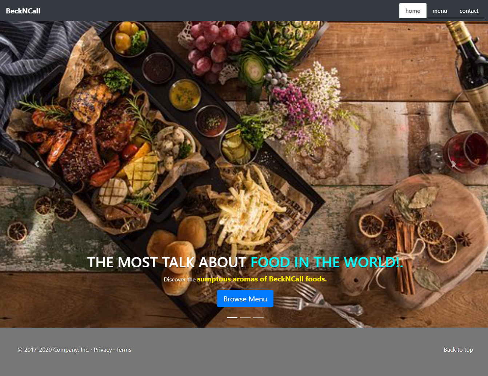

# README

 

# This Project is Restaurant app build using JavaScript to render the page. It is a simple restaurant page with 3 pages.

> In this project, i built a `Restaurant` app following the [OdinProject](https://www.notion.so/Lifestyle-articles-b82a5f10122b4cec924cd5d4a6cf7561) specification. 

## Project Description

The project is initialized by running `npm install webpack webpack-cli --save-dev` to install webpack to the node_modules directory of your project.
A `src and dist` is created in the directory with the following contents:
- index.js file in src.
- index.html file in dist. 
- main.js is by generated by webpack when you run `npm run build`.
- A `webpack.config.js` is created to do the basic configurations.
- An HTML skeleton inside of `dist/index.html` file.

Bare-bones homepage is created for a restaurant. with the Inclusion an image, headline, and some copy about how wonderful the restaurant is. The html is then removed  and instead created by using JavaScript only. 
The code is modularised with different functions and imported and call it inside of index.js. to run the application.

Next, was to set up the restaurant site to use tabbed browsing to access the Contact and Menu pages. 
The project is hosted on gh-pages.

## 

## Link to Live Demo:

[Restaurant](https://uimarshall.github.io/microverse-restaurant-project/)

## Built With

- JavaScript ES6
- HTML
- CSS
- Bootstrap
- WebPack bundler

## Deployed on:

- gh-pages

## Prerequisities

To get this project up and running locally, you must have  yarn and node installed on your computer.

## Getting Started

**To get this project set up on your local machine, follow these simple steps:**

**Step 1** 
Navigate through the local folder where you want to clone the repository and run
`git clone https://github.com/uimarshall/microverse-restaurant-project`. 

**Step 2** 
`cd microverse-restaurant-project`. 

**Step 3** 
Run `npm install` to install the packages from the `package.json`. 

**Step 4** 
Run `npm start` to open the application in a browser of your choice. 

**Step 5** 
You can navigate to `http://localhost:8080/` to see your application running 

## Authors

👤 **Marshall Akpan**

- Github: [uimarshall](https://github.com/uimarshall)
- Twitter: [uimarshall](https://twitter.com/uimarshall)
- Linkedin: [Marshall Akpan](https://www.linkedin.com/in/marshall-akpan-19745526/)

## 🤝 Contributing

Our favourite contributions are those that help us improve the project, whether with a contribution, an issue, or a feature request!

Feel free to check the [issues page](https://github.com/uimarshall/microverse-restaurant-project/issues) to either create an issue or help us out by fixing an existing one.

## Show your support

If you've read this far....give us a ⭐️!

## :clap: Acknowledgements

- Microverse
- OdinProject

## 📝 License

This project is licensed by Microverse and the Odin Project

- ...
